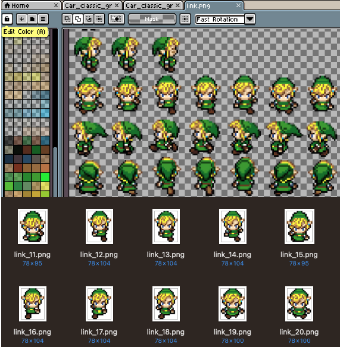

# Extract Sprites (OCaml CLI)

A fast, dependency-light **sprite extractor** written in OCaml.  
It loads an image, thresholds it, finds connected components, and crops each sprite into its own PNG file.

**Example usage**:  For developing games, you need to extract a lot of sprites off a spritesheet and create an atlas with Texture Packer Pro.



---

## Features

- Pure OCaml implementation — no Python or C dependencies (No OpenCV)
- Uses [ImageLib](https://github.com/rlepigre/ocaml-imagelib) for image I/O (`.png`, `.jpg`, etc.)
- Finds connected regions of non transparent pixels  
- Filters small fragments of pixels
- Exports cropped sprite frames as PNGs  
- CLI built with **Cmdliner** for flexible options  

---

## Installation

OCaml, dune, and ImageLib:

```bash
opam install dune cmdliner imagelib
dune build
```

## Command-line Options

| Flag                             | Default      | Description                                      |
| -------------------------------- | ------------ | ------------------------------------------------ |
| `INPUT`                          | *(required)* | Path to spritesheet (`.png`, `.jpg`, etc.)       |
| `-o`, `--output-dir DIR`         | `frames`     | Directory to write extracted sprites             |
| `-p`, `--prefix PREFIX`          | `frame_`     | Prefix for output filenames                      |
| `-m`, `--min-area AREA`          | `64`         | Minimum connected component area (in pixels)     |
| `-t`, `--alpha-threshold THRESH` | `1`          | Pixel threshold for foreground (0–255)           |


## Examples

### Extract sprites using all defaults
```bash
dune exec -- ./extract_sprites.exe link_sprites.png
```

### Custom output directory and prefix

```bash
dune exec -- ./extract_sprites.exe link_sprites.png \
  -o extracted_frames -p car_ -m 200 -t 5
```

- Works best on images with clear transparency between sprites.

- If tiny particles (dust, exhaust, particals) are cut as separate frames, increase `--min-area`.


